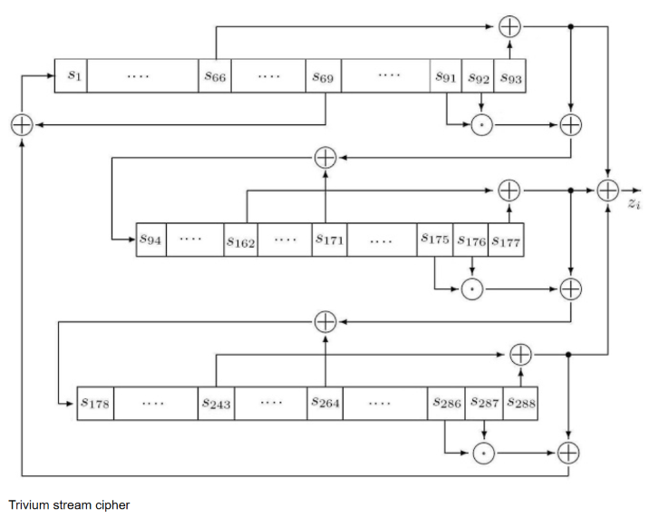

# Trivium Stream Cipher - Verilog Implementation

This repository contains my Verilog implementation of the Trivium stream cipher, a prominent member of the eSTREAM portfolio. The design is written for simulation and verification purposes, and features an integrated state machine to automate the initialization process. It generates a single keystream bit per clock cycle.

## Design Highlights

- **Specification Compliance:** Fully implements the standard Trivium specification using an 80-bit Secret Key and an 80-bit Initialization Vector (IV).
- **Steady Throughput:** Generates exactly 1 keystream bit per clock cycle.
- **Automated Initialization:** Features a built-in finite state machine (FSM) that autonomously handles the required 1152-cycle warm-up phase.
- **Simulation-Ready:** Written in standard Verilog for functional verification and testing.
- **Modular Design:** Utilizes separate shift register modules for clarity and ease of testing.

## Architecture and Working Principle

The core of the Trivium cipher relies on three Non-Linear Feedback Shift Registers (NFSRs) that interact via cross-coupled feedback loops. 



As illustrated in the diagram above, the 288-bit internal state is distributed across three registers. The multiplication dots in the diagram represent the AND gates that introduce the non-linear operations required for the cipher's security.

1. **Shift Register 1 (93 bits):** Loaded with the 80-bit Secret Key (padded with 13 zeros).
2. **Shift Register 2 (84 bits):** Loaded with the 80-bit Initialization Vector (padded with 4 zeros).
3. **Shift Register 3 (111 bits):** Initialized with a specific constant pattern (108 zeros followed by three ones).

During operation, the feedback from each register is routed to the input of the next register in the sequence, creating a continuous, non-linear mixing of the internal state.

## State Machine Operation

To simplify integration, I designed a finite state machine within the top-level module to manage the cipher's lifecycle. The operation flows through four distinct states:

1. **`IDLE`:** The cipher is inactive and awaiting a start command.
2. **`LOAD`:** Triggered by the `start` signal. Takes exactly one clock cycle to parallel-load the Key, IV, and constants into the shift registers.
3. **`WARMUP`:** The cipher runs autonomously for 1152 clock cycles (4 full cycles of the 288-bit state). This thoroughly mixes the key and IV before any output is generated.
4. **`RUN`:** The warm-up phase is complete. The `ready` signal is asserted, and the `output_bit` provides a valid keystream bit on every subsequent clock cycle.

## Interface (Port Descriptions)

Below are the ports for the top-level `trivium_cipher` module:

| Port Name | Direction | Width | Description |
| :--- | :---: | :---: | :--- |
| `clk` | Input | 1 | System clock. |
| `rst` | Input | 1 | Active-high reset. Clears the state machine and registers. |
| `start` | Input | 1 | Assert high for one cycle to initiate the Key/IV loading process. |
| `secret_key` | Input | 80 | The 80-bit secret key. |
| `initialization_vector`| Input | 80 | The 80-bit Initialization Vector (IV). |
| `ready` | Output | 1 | Asserts HIGH when the 1152 warm-up cycles are complete. |
| `output_bit` | Output | 1 | The 1-bit keystream output. Valid only when `ready` is HIGH. |

## Simulation and Usage

Simulating this cipher is straightforward. Instantiate the top-level module in your testbench, provide the cryptographic inputs, and pulse the start signal.

```verilog
trivium_cipher u_trivium (
    .clk                  (system_clk),
    .rst                  (system_rst),
    .start                (start_pulse),
    .initialization_vector(iv),
    .secret_key           (key),
    .ready                (cipher_ready),
    .output_bit           (keystream_bit)
);
